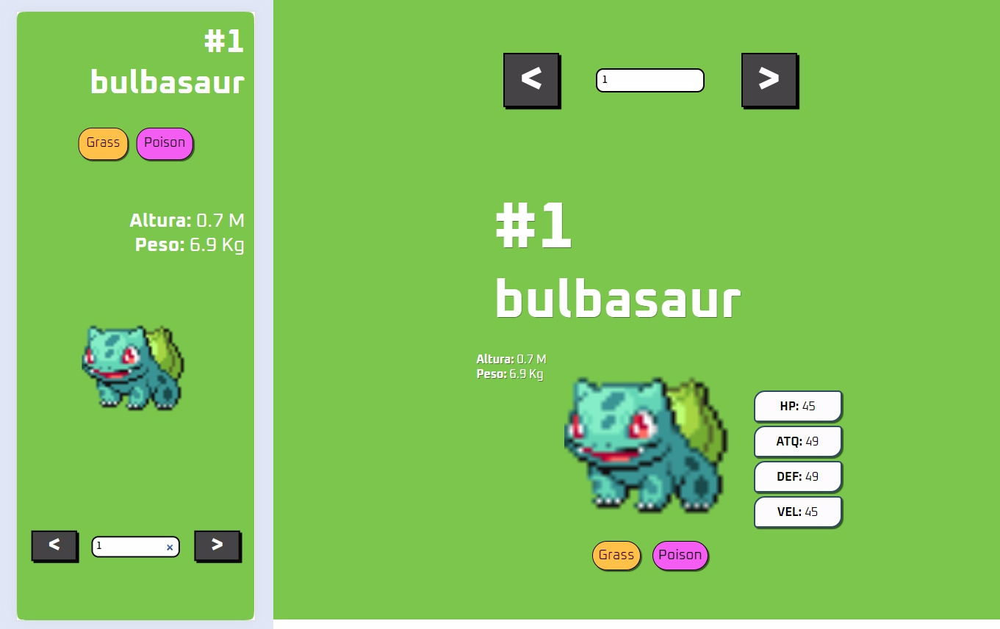

<h1>Web Pokedex</h1>

<h2>sobre</h2>

    Este projeto consiste em uma Pokédex interativa desenvolvida como aplicação web, consumindo dados da <a href="https://pokeapi.co">PokéAPI</a>, uma API pública que fornece informações sobre os Pokémons. A interface permite pesquisar e visualizar detalhes de diversos Pokémon, como seus <strong>nomes/id</strong>, <strong>tipos</strong>, <strong>atributos</strong> e <strong>imagens.</strong>

<h2>Funcionalidades</h2>

    <ul>
        <li><strong>Pesquisa de Pokémon:</strong> Os usuários podem pesquisar Pokémon pelo nome ou número da Pokédex.</li>
        <li><strong>Exibição de Detalhes:</strong> A exibição de detalhes é diferente para cada dispositivo (mobile/desktop). Cada Pokémon possui uma página de detalhes com informações específicas, como altura, peso, tipos e atributos</li>
        <li><strong>Desing de Página: </strong>O foco do desing é parecer como <abbr title="cartas de Pokemon">cards</abbr> digitais</li>
        <h3>Casos</h3>
        <ul>
            <li>A cor de fundo é modificada para cada tipo pokemon</li>
            <li>Botões de ação para avançar e retroceder</li>
            <li>Input de pesquisa para nome ou id</li>
            <li>Caso a imagem não possa ser exibida, uma imagem padrão é exposta</li>
            <li>Listagem de atributos Hp, ataque, defesa e velocidade</li>
            <li>Listagem de peso e altura</li>
        </ul>
    </ul>

<h2>Tecnologias Utilizadas</h2>

    
    
    
    
    
    <h3>Layout Responsivo</h3>
    
  

<h2>Como Usar</h2>

    <ol>
        <li><a href="https://0arkes.github.io/Pokedex/" target="_blank">Clique aqui</a></li>
        <li>Insira o nome ou número do Pokémon que deseja visualizar.</li>
        <li>Ou use os botões &gt; e &lt; para avançar ou regredir respectivamente entre os pokemons</li>
        Explore informações e características sobre cada Pokémon.
        <li>Explore as informações consumidas da api sobre cada Pokémon</li>
    </ol>

